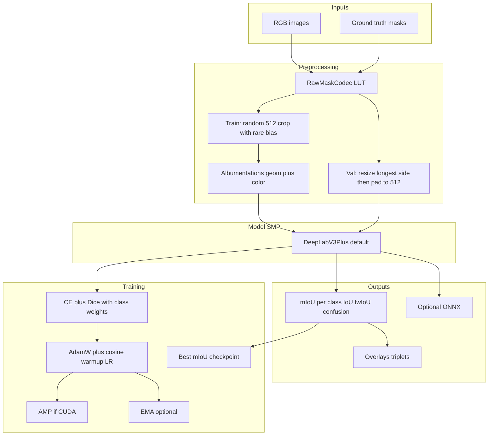
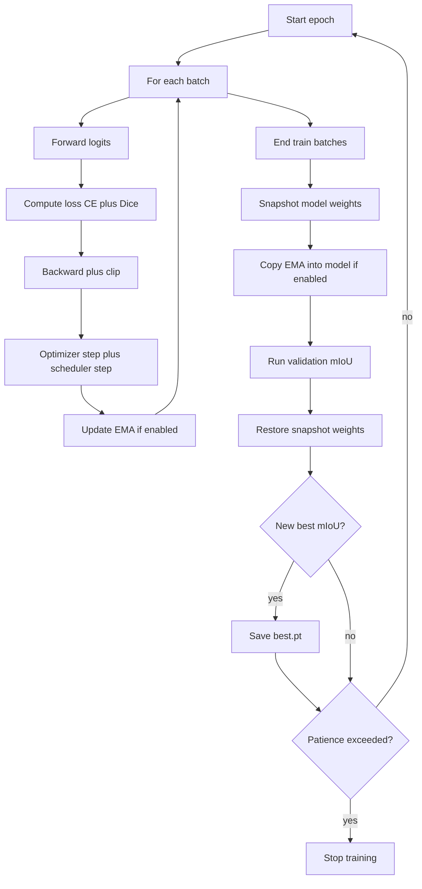
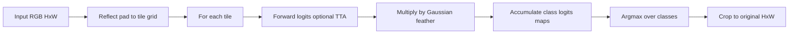

# Desert Semantic Segmentation

End-to-end **semantic segmentation** for **off-road / desert** scenes: every pixel is classified into one of several terrain / object categories. The pipeline is built for **synthetic RGB + mask** data, **PyTorch**, **[segmentation_models_pytorch](https://github.com/qubvel/segmentation_models.pytorch)** (SMP), **Albumentations**, and hackathon-style iteration (strong baselines, IoU-driven checkpoints, optional EMA / TTA / ONNX).

---

## Table of contents

1. [What this project does](#1-what-this-project-does)
2. [Problem statement and goals](#2-problem-statement-and-goals)
3. [Dataset layout and assumptions](#3-dataset-layout-and-assumptions)
4. [Label format (critical)](#4-label-format-critical)
5. [Repository structure](#5-repository-structure)
6. [Configuration (`default.yaml`)](#6-configuration-defaultyaml)
7. [High-level architecture](#7-high-level-architecture)
8. [Data pipeline (detailed)](#8-data-pipeline-detailed)
9. [Model](#9-model)
10. [Loss functions](#10-loss-functions)
11. [Metrics](#11-metrics)
12. [Training loop](#12-training-loop)
13. [Validation and evaluation scripts](#13-validation-and-evaluation-scripts)
14. [Inference (testing folder, sliding window, TTA, ONNX)](#14-inference-testing-folder-sliding-window-tta-onnx)
15. [Checkpoints and artifacts](#15-checkpoints-and-artifacts)
16. [How to run (commands)](#16-how-to-run-commands)
17. [Interactive demo (Gradio)](#17-interactive-demo-gradio)
18. [Tests](#18-tests)
19. [Dependencies and environment notes](#19-dependencies-and-environment-notes)
20. [Design decisions and limitations](#20-design-decisions-and-limitations)
21. [Extending the project](#21-extending-the-project)
22. [Flowcharts](#22-flowcharts)

---

## 1. What this project does

- **Input:** RGB color images (`Color_Images`).
- **Supervision:** Per-pixel class masks (`Segmentation`) aligned by **filename** with the RGB image.
- **Output:** A trained neural network that predicts a **class index per pixel** on validation, held-out **testing** images (no labels in repo), or any folder of images you point inference at.
- **Primary quality metric:** **mean Intersection-over-Union (mIoU)** on the validation set, plus **per-class IoU**, **frequency-weighted IoU (fwIoU)**, and a **confusion matrix**.

---

## 2. Problem statement and goals

| Goal | How we address it |
|------|-------------------|
| Accurate pixel-wise classification | DeepLabV3+ with ImageNet-pretrained encoder; CE + Dice loss; class-frequency weights |
| Robustness (synthetic → harder real domains) | Strong photometric + mild “desert-like” augmentations (sun flare, shadow, blur, noise, JPEG) |
| Class imbalance | Inverse log-frequency weights with a **cap**; rare-class-biased random crops |
| Stable training | AdamW, cosine decay with **warmup**, gradient clipping, optional **EMA** |
| Fast iteration | YAML-driven config; SMP for one-line model construction; scripts for train / eval / infer |
| Deployment story | Optional **ONNX** export; inference timing written to `latency.txt` |

**Note:** The original hackathon plan also mentioned **SegFormer-B2** as a balanced option. This codebase’s **default** is **DeepLabV3+ + ResNet-50**. UNet and FPN are supported in code; SegFormer is **not** implemented as a separate architecture in `models/factory.py` (you can experiment with **MiT** encoders under DeepLabV3+ if SMP supports your chosen encoder name).

---

## 3. Dataset layout and assumptions

All paths in config are **relative to the workspace root** (`--root` on the CLI, or the repo root by default).

```text
<root>/
  training/
    train/
      Color_Images/     # RGB training inputs
      Segmentation/     # Training masks (same filenames as Color_Images)
    val/
      Color_Images/     # RGB validation inputs
      Segmentation/     # Validation masks
  testing/
    Color_Images/       # Unlabeled images for final inference / demo
```

**Pairing rule:** For each split, every file in `Color_Images` must have a mask with the **same basename** in `Segmentation`. The dataset constructor raises if a mask is missing.

**Typical image size in this workspace:** RGB and masks are often **960×540** (masks are single-channel uint16 PNGs). Training uses **512×512** crops; validation pads to a **512×512** canvas for batching.

---

## 4. Label format (critical)

### 4.1 What the masks are

- Masks are read as **2D arrays** (single channel).
- In this dataset they behave as **`I;16` (16-bit unsigned)** semantic IDs: pixel values are **not** 0, 1, 2, …  
  They are **dataset-specific raw IDs**, e.g. `100, 200, 300, 500, 550, 600, 700, 800, 7100, 10000`.

### 4.2 Mapping raw IDs → training indices

The class `RawMaskCodec` in `desert_segmentation/data/mask_encoding.py`:

1. Builds a **lookup table (LUT)** from `max(raw_ids)` down to 0.
2. Maps each legal raw ID to a contiguous index **`0 … num_classes-1`** (uint8 for Albumentations compatibility).
3. **Raises** if any pixel is not in the configured `raw_ids` list (unknown pixels would map to sentinel `255` in the LUT and trigger an error).

**Why this matters:** Using the wrong mapping (or treating masks as 8-bit class indices) silently destroys learning.

### 4.3 Ignore index (255)

- **Training:** `ShiftScaleRotate` can introduce border pixels on the mask; those are filled with **`ignore_index` (255)**. Cross-entropy and Dice **ignore** those pixels.
- **Validation:** `PadIfNeeded` pads the mask with **255** so square tensors align; metrics and loss skip those pixels.

### 4.4 Class names

`class_names` in YAML are **display labels** (e.g. `id_100`, …). Replace them with semantic names (e.g. `sky`, `sand`) when you have official ontology from the dataset provider.

---

## 5. Repository structure

```text
codewizard 2.0/
  README.md                          # This file
  requirements.txt                   # Python dependencies
  requirements-demo.txt              # Optional: Gradio demo
  desert_segmentation/               # Importable package
    __init__.py
    configs/
      default.yaml                   # Single source of truth for paths & hyperparameters
    data/
      dataset.py                     # SegmentationDataset (pairing, crop, rare bias)
      transforms.py                  # Albumentations train/val pipelines
      mask_encoding.py               # RawMaskCodec + build_codec_from_config
    models/
      factory.py                     # SMP: DeepLabV3+, UNet, FPN
    losses/
      combined.py                    # CE, weighted CE, focal, CE+Dice + weight helper
    metrics/
      iou.py                         # Confusion matrix, IoU, mIoU, fwIoU
    train/
      trainer.py                     # Main training loop (AMP, EMA, scheduler, checkpoints)
      evaluate.py                    # Batched validation metric pass
    infer/
      predict.py                     # Sliding window, TTA, folder inference, ONNX export
    utils/
      config.py                      # YAML load + path resolution
      seed.py                        # Reproducibility
      logging_utils.py               # Logging setup
      freq.py                        # Scan mask folders for class frequencies
      viz.py                         # Colorization + overlay + triplet PNG export
    demo/
      inference_ui.py                # Gradio helpers: legend HTML, validation, composites
  scripts/
    train.py                         # CLI: train from config
    eval.py                          # CLI: val metrics + confusion + visualization PNGs
    eval_summary.py                  # CLI: mIoU (all + valid-GT), fwIoU, accuracies, GT counts, per-class table (+ JSON)
    infer.py                         # CLI: run on testing/ or export ONNX
    demo_gradio.py                  # CLI: browser upload demo (Gradio)
  tests/
    test_mask_encoding.py            # Unit tests for codec / unknown pixels
```

**Scripts** add the repo root to `sys.path` so you can run them without installing the package as a wheel.

---

## 6. Configuration (`default.yaml`)

Key sections (see `desert_segmentation/configs/default.yaml` for the full file):

| Section | Purpose |
|---------|---------|
| `root` | Base path for resolving relative data paths (overridden by `--root` in scripts) |
| `data.*` | Relative dirs for train/val images and masks, test images, `raw_ids`, `class_names`, `crop_size`, `rare_class_crop_prob`, `weighted_sampler`, `weighted_sampler_eps`, `ignore_index` |
| `model.*` | `architecture` (`deeplabv3plus` \| `unet` \| `fpn`), `encoder_name`, `encoder_weights` |
| `train.*` | `batch_size`, `epochs`, `lr`, `weight_decay`, `warmup_ratio`, `amp`, `gradient_clip`, `seed`, `checkpoint_dir`, `log_interval`, `early_stop_patience` |
| `loss.*` | `name` (`ce` \| `weighted_ce` \| `ce_dice` \| `focal_ce` \| `focal_ce_dice`), `dice_weight`, `label_smoothing` (CE modes only), `class_weight_cap`, `focal_gamma` |
| `augmentation.strong` | Enables extra sun flare + shadow blocks in training |
| `ema.*` | Optional exponential moving average of weights for evaluation |
| `inference.*` | `tile_size`, `overlap` (for sliding window), `tta_flip`, `batch_size` (reserved for future batching) |

---

## 7. High-level architecture



---

## 8. Data pipeline (detailed)

### 8.1 `SegmentationDataset` (`data/dataset.py`)

1. **List images** in `images_dir` with extensions: `.png`, `.jpg`, `.jpeg`, `.bmp`, `.tif`, `.tiff`.
2. **Verify** each image has a mask with the same filename in `masks_dir`.
3. **Load RGB** with Pillow → `HxWx3` uint8.
4. **Load mask** as numpy 2D → cast to `uint16` → **`codec.encode_mask`** → `HxW` uint8 with values `0 … C-1` (or padded 255 later in transforms).

**Train mode (`mode="train"`):**

- **`_random_crop_bias_rare`:** Extract a **`crop_size × crop_size`** patch.
  - With probability `rare_class_crop_prob` (default **0.35**), pick the **rarest class** in that image (by histogram) and center the crop on a random pixel of that class (if any exist).
  - Otherwise pick a uniformly random center.
- If the image is smaller than the crop, **zero-pad** the image and **255-pad** the mask (ignore regions).

**Val mode (`mode="val"`):**

- No random crop in the dataset; the **full** image goes to Albumentations.

### 8.2 Transforms (`data/transforms.py`)

**Train (`build_train_transforms`):**

- **Geometric:** `HorizontalFlip`, `ShiftScaleRotate` (shift, scale, ±10° rotation) with `mask_value=ignore_index` on borders.
- **Photometric:** brightness/contrast, hue/sat/value, Gaussian blur, Gaussian noise, JPEG compression simulation, RGB shift.
- **If `augmentation.strong`:** `RandomSunFlare`, `RandomShadow` (desert-relevant appearance stress).
- **Normalize:** ImageNet mean/std.
- **`ToTensorV2`:** Image → `float` tensor `CHW`; mask handled so downstream converts to `long` in `__getitem__`.

**Val (`build_val_transforms`):**

- `LongestMaxSize(crop_size)` then `PadIfNeeded(crop_size, crop_size)` with **mask pad = 255** (ignored in loss/metrics).

### 8.3 Class frequency estimation (`utils/freq.py`)

Before training, `scripts/train.py` calls **`estimate_pixel_frequencies`** over **all** training mask files (configurable `max_files` in code; train script uses full corpus). This yields a normalized frequency vector per class → used to build **class weights**.

---

## 9. Model

**Factory:** `desert_segmentation/models/factory.py`

| `architecture` | SMP class | Notes |
|----------------|-----------|--------|
| `deeplabv3plus` (default) | `smp.DeepLabV3Plus` | Mainline; strong decoder + atrous spatial pyramid |
| `unet` | `smp.Unet` | Classic encoder–decoder skips |
| `fpn` | `smp.FPN` | Feature pyramid neck |

**Default encoder:** `resnet50` with `encoder_weights: imagenet`.

**Forward:** Input batch `N×3×H×W` → logits `N×C×H×W` where `C = num_classes`.

---

## 10. Loss functions

**File:** `desert_segmentation/losses/combined.py`

**Modes (`loss.name`):**

| Mode | Description |
|------|-------------|
| `ce` | Plain cross-entropy, unweighted |
| `weighted_ce` | Cross-entropy with per-class `weight` tensor |
| `ce_dice` (default) | `CE(weighted) + dice_weight * multiclass_Dice_loss` |
| `focal_ce` | Focal modulated CE; optional class weights on pixels |
| `focal_ce_dice` | `focal_ce` + `dice_weight * multiclass_Dice_loss` (same class weights in focal term) |

**Shared options:**

- **`ignore_index`:** Pixels with label 255 are masked out of CE / focal / dice.
- **`label_smoothing`:** Applied to **CE-based** modes (`ce`, `weighted_ce`, `ce_dice`) only; not used in `focal_ce` / `focal_ce_dice`.

**Class weights (`compute_class_weights_from_freq`):**

1. Start from per-class pixel frequency `freq` on the training masks.
2. `w ∝ 1 / log(freq + ε)`, normalize by mean.
3. Clamp the ratio `w / median(w)` to **`class_weight_cap`** (default **15**) so rare classes do not explode the loss.

---

## 11. Metrics

**File:** `desert_segmentation/metrics/iou.py`

1. **Confusion matrix** `C×C` (implementation uses `idx = tgt * C + pred` then `bincount`; rows correspond to **ground-truth class**, columns to **predicted class**).
2. **Per-class IoU:**  
   \(\text{IoU}_k = \frac{TP_k}{TP_k + FP_k + FN_k}\)  
   with `TP_k = CM[k,k]`, row/col sums for FP/FN.
3. **mIoU:** Mean of per-class IoU over finite entries.
4. **fwIoU (frequency-weighted IoU):** \(\sum_k \text{IoU}_k \cdot p_k\) where \(p_k\) is the empirical frequency of class \(k\) in the ground-truth pixels (column marginals).

**Note:** The docstring in `compute_confusion` mentions “pred rows, target columns”; the actual indexing follows **`tgt` (row) × `C` + `pred` (col)`** after reshape.

---

## 12. Training loop

**File:** `desert_segmentation/train/trainer.py`

**Optimizer:** AdamW on all parameters.

**Learning rate:** `LambdaLR` with:

- **Linear warmup** for `warmup_ratio` of total optimizer steps (default **8%**).
- **Cosine** decay from 1.0 down to `min_ratio` **0.01** (implemented in `_warmup_cosine_lambda`).

**AMP (mixed precision):**

- Enabled only if `train.amp` is true **and** `torch.cuda.is_available()`.
- Uses `torch.cuda.amp.autocast` + `GradScaler` when on CUDA.
- On **CPU**, AMP is off; training uses standard FP32 backward (no scaler).

**Gradient clipping:** Global norm clip when `gradient_clip > 0` (default **1.0**).

**EMA (optional):**

- If `ema.enabled`, after each optimizer step the code maintains a **shadow weight** copy per trainable parameter: exponential decay **0.999** by default.
- **Each epoch:** Training weights are **deep-copied**; **EMA weights are copied into the model** for validation only; then the training snapshot is **restored** so optimization continues from the non-EMA weights.

**Checkpointing:**

- Every epoch: `checkpoints/last.pt` (model, optional EMA dict, optimizer, full config, class names).
- **Best validation mIoU:** `checkpoints/best.pt` (adds `miou`, `per_class_iou`).

**Early stopping:** If validation mIoU does not improve for `early_stop_patience` epochs (default **12**), training stops.

**Optional smoke flags (`scripts/train.py`):**

- `--epochs N` — override epoch count.
- `--max_train_batches K` — stop each training epoch after `K` batches (debug only; scheduler still advances per batch).

**Logging:** `checkpoints/history.json` lists per-epoch `miou` and `fw_iou`.

---

## 13. Validation and evaluation scripts

**Core loop:** `desert_segmentation/train/evaluate.py` runs the model in `eval()` mode, accumulates confusion via `IoUMetrics`, returns a dict.

**CLI:** `scripts/eval.py`

1. Loads config + builds validation dataset (same codec and val transforms as training).
2. Loads checkpoint from `--checkpoint`.
3. **Weight loading priority:** If `ema` dict exists in checkpoint, **EMA tensors are copied into parameters** for evaluation; else `state_dict` from `model` key.
4. Runs full val loader → logs **mIoU**, **fwIoU**, per-class IoU.
5. Writes:
   - `eval_outputs/metrics.json` (or `--out_dir`)
   - `confusion.npy`
   - Up to `--max_viz` side-by-side **RGB | GT | Pred** PNGs (`save_triplet` in `utils/viz.py`), with ImageNet denormalization for RGB panels.

---

## 14. Inference (testing folder, sliding window, TTA, ONNX)

**CLI:** `scripts/infer.py`

### 14.1 Folder inference

- Reads `testing/Color_Images` (or whatever `data.test_images` points to).
- Loads checkpoint with the same **EMA-first** rule as eval.
- For each image:
  - If **both** height and width ≤ `tile_size` (512): single forward pass.
  - Else: **sliding window** with stride `tile_size * (1 - overlap)` (default overlap **0.25** → stride **384**).
  - Pads the image with **reflect** padding so tile grid covers corners; crops back to original size.
  - Accumulates **per-class logits** weighted by a **2D Gaussian** (`sigma ∝ tile/3`) so tile borders blend smoothly; final prediction is **`argmax` over classes** per pixel.

### 14.2 Test-time augmentation (TTA)

If `inference.tta_flip` is true: logits = **0.5 × (logits(x) + unflip(logits(flip(x))))** horizontally.

### 14.3 Outputs

Under `--out_dir` (default `infer_outputs/`):

- `pred_<filename>` — color overlay (prediction tinted on RGB).
- `triplet_<filename>` — **RGB | blank or GT | Pred** strip (test set has no GT, so middle panel is zeros in current `save_triplet` usage).
- `latency.txt` — mean milliseconds per image and device string.

### 14.4 ONNX

`python scripts/infer.py --checkpoint ... --onnx model.onnx` calls `export_onnx`: builds model on **CPU**, dummy input `1×3×512×512`, `torch.onnx.export` with dynamic axes for batch and spatial size.

---

## 15. Checkpoints and artifacts

| Artifact | Contents |
|----------|----------|
| `checkpoints/best.pt` | `model`, `ema` (optional), `miou`, `per_class_iou`, `config`, `class_names` |
| `checkpoints/last.pt` | Latest epoch snapshot + optimizer |
| `checkpoints/history.json` | List of `{epoch, miou, fw_iou}` |
| `eval_outputs/*` | `metrics.json`, `confusion.npy`, visualization PNGs |
| `infer_outputs/*` | Overlays, triplets, `latency.txt` |

---

## 16. How to run (commands)

From the repository root (adjust paths if yours differ).

### 16.1 Install

```powershell
python -m pip install -r requirements.txt
```

### 16.2 Train

```powershell
$env:PYTHONPATH="."
python scripts\train.py --root "d:\codewizard 2.0"
```

Optional:

```powershell
python scripts\train.py --root "d:\codewizard 2.0" --config desert_segmentation\configs\default.yaml --epochs 5 --max_train_batches 50
```

**Imbalanced classes (optional YAML):** set `loss.name` to `focal_ce_dice` for focal + Dice; tune `class_weight_cap`, `rare_class_crop_prob`, and/or `data.weighted_sampler: true` to oversample train images that contain rare classes (scans all train masks once at startup—can take a minute on large sets).

### 16.3 Evaluate (validation)

```powershell
python scripts\eval.py --root "d:\codewizard 2.0" --checkpoint checkpoints\best.pt --out_dir eval_outputs
```

**Metric summary (no PNGs):** prints **mIoU (all classes)** and **mIoU (classes with val GT)** (the latter ignores absent classes so it is easier to interpret on sparse val labels), **fwIoU**, **global / mean class accuracy**, **val GT pixel counts per class**, and a **per-class IoU / recall** table. Same validation forward pass as `eval.py`. Optional: `--json-out eval_summary.json` (includes `miou_valid_gt_classes`, `val_gt_pixel_counts`).

```powershell
python scripts\eval_summary.py --root "d:\codewizard 2.0" --checkpoint checkpoints\best.pt --json-out eval_summary.json
```

To print only **mIoU** and **per-class IoU** stored inside the checkpoint (no GPU eval): `python scripts\eval_summary.py --from-checkpoint-only --checkpoint checkpoints\best.pt`

### 16.4 Infer on `testing/Color_Images`

```powershell
python scripts\infer.py --root "d:\codewizard 2.0" --checkpoint checkpoints\best.pt --out_dir infer_outputs --limit 20
```

### 16.5 Export ONNX

```powershell
python scripts\infer.py --root "d:\codewizard 2.0" --checkpoint checkpoints\best.pt --onnx model.onnx
```

---

## 17. Interactive demo (Gradio)

Upload an RGB image in the browser and get a **colored class mask**, **overlay**, a **side-by-side strip** (RGB | mask | overlay), a **fixed legend** (colors match `palette()` in training), **inference time**, and **dominant classes** (pixel histogram). Uses the same path as CLI inference: [`_load_model_for_inference`](d:\codewizard 2.0\desert_segmentation\infer\predict.py) and [`predict_image`](d:\codewizard 2.0\desert_segmentation\infer\predict.py) (EMA weights preferred when present in the checkpoint).

**Install** (base + demo extras):

```powershell
python -m pip install -r requirements.txt -r requirements-demo.txt
```

**Run** (from repo root; model loads **once** at startup — look for a log line `Model ready`):

```powershell
$env:PYTHONPATH="."
python scripts\demo_gradio.py --root "d:\codewizard 2.0" --checkpoint checkpoints\best.pt
```

**CLI flags:** `--host` (default `127.0.0.1`), `--port` (default `7860`), `--share` (temporary public Gradio link), `--max-side`, `--max-megapixels` (reject huge uploads before inference).

**Environment variables** (optional defaults if flags omitted):

| Variable | Purpose |
|----------|---------|
| `ROOT` | Workspace root (same as `--root`) |
| `CHECKPOINT_PATH` | Path to `best.pt` (relative paths resolve under `ROOT`) |

**Advanced panel:** TTA on/off, tile overlap slider, tile size slider (256–2048, step 64). Overrides are passed into `predict_image` only; the checkpoint file is not modified.

**v1 limitations:** No per-pixel **confidence heatmap** for full sliding-window runs (only `argmax` is returned from `predict_image`). See plan follow-up to add logits fusion if needed.

**Windows:** Use backslashes or quoted paths as above; first launch may be slow while dependencies initialize.

**Follow-ups (not in v1):** full-resolution **confidence** heatmap (needs logits path in `predict.py`); **ZIP** batch upload; **two-checkpoint** comparison UI; client-side **ONNX** inference.

---

## 18. Tests

```powershell
python -m pytest tests\test_mask_encoding.py -q
```

Covers:

- Round-trip **raw mask ↔ class indices** for known IDs.
- **Unknown raw pixel** raises `ValueError`.
- LUT correctness for each configured raw id.

---

## 19. Dependencies and environment notes

**`requirements.txt`:**

- `torch`, `torchvision`, `numpy`, `Pillow`, `PyYAML`
- `albumentations` pinned to `<1.5` to reduce optional native build issues on some Windows setups
- `segmentation-models-pytorch` (SMP)
- `tqdm`, `pytest`
- Optional demo: `requirements-demo.txt` adds **Gradio**

**Windows:** `scripts/train.py` and `scripts/eval.py` set `num_workers=0` for `DataLoader` on NT to avoid multiprocessing friction.

**SMP pretrained weights:** First run may download encoder weights (e.g. ResNet-50 ImageNet) via SMP / Hugging Face hubs depending on SMP version.

---

## 20. Design decisions and limitations

| Topic | Decision / limitation |
|-------|------------------------|
| Mask modes | **16-bit raw IDs** supported via LUT; **P-mode palette** and **RGB color masks** are *not* auto-detected in this codebase—extend `mask_encoding.py` if your dataset uses them |
| SegFormer | **Not** a separate `architecture` enum; plan mentioned SegFormer-B2 as an alternative—would require additional factory code or using a supported SMP encoder |
| Val resolution | Images are **letterboxed** to 512×512 for batching; mIoU is on padded regions with ignore—fine for hackathon; for publication-grade eval consider sliding-window val too |
| Inference fusion | Overlapping tiles add **Gaussian-weighted logits** per class into an accumulator; the final label is **`argmax` over the accumulated logits** (feathered overlap fusion). A per-pixel `weight` tensor is also accumulated in code for possible future normalization extensions |
| Poly LR / sync BN | **Not** implemented (cosine+warmup only) |
| Ensemble | **Not** implemented (single model + optional EMA) |

---

## 21. Extending the project

1. **New classes / raw IDs:** Edit `data.raw_ids` and `data.class_names` in YAML; rerun frequency scan is automatic in `train.py`.
2. **UNet / FPN:** Set `model.architecture` to `unet` or `fpn`; pick a valid `encoder_name` for SMP.
3. **Larger encoder:** e.g. `encoder_name: resnet101` for DeepLabV3+.
4. **Loss ablation:** Set `loss.name` to `ce`, `weighted_ce`, `focal_ce`, or `focal_ce_dice`; tune `dice_weight`, `label_smoothing`, `class_weight_cap`.
5. **Stronger aug:** Add Albumentations ops in `transforms.py` (keep `additional_targets={"mask":"mask"}` for paired geometry).

---

## 22. Flowcharts

### 22.1 Training epoch (simplified)



### 22.2 Inference on large images



---

## Acknowledgments

- **segmentation_models_pytorch** (Pavel Iakubovskii and contributors) for modular segmentation architectures.
- **Albumentations** for fast, paired image–mask augmentations.

---

*Generated to document the implementation in this repository as of the README authoring date. For the original hackathon planning narrative, see your separate plan document (not stored in this repo’s `README`).*
